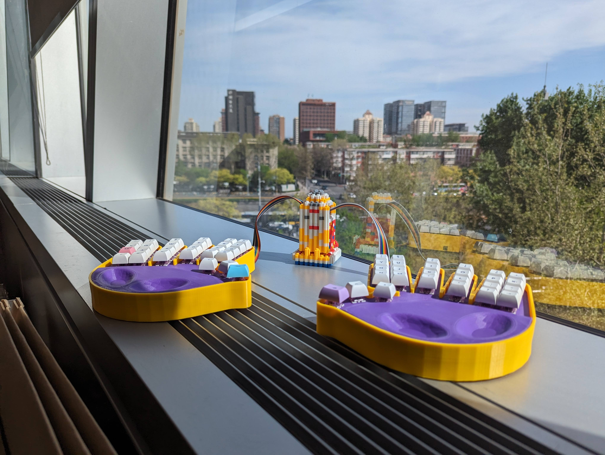
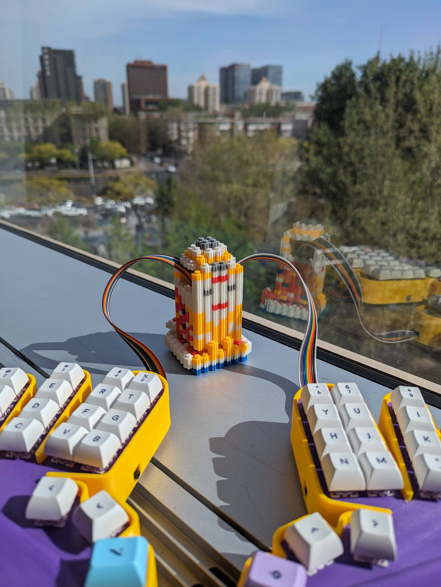
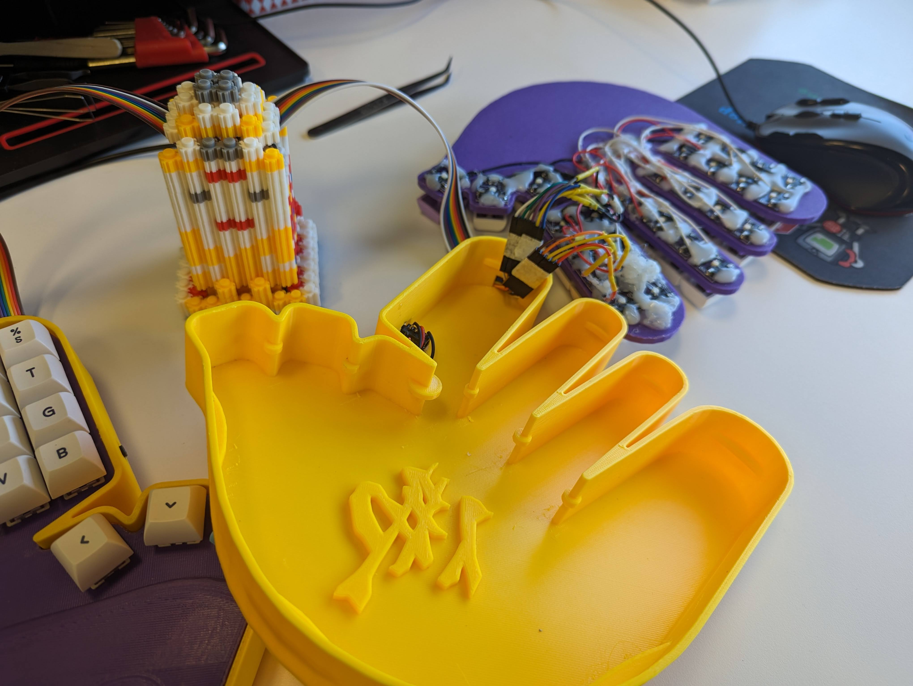
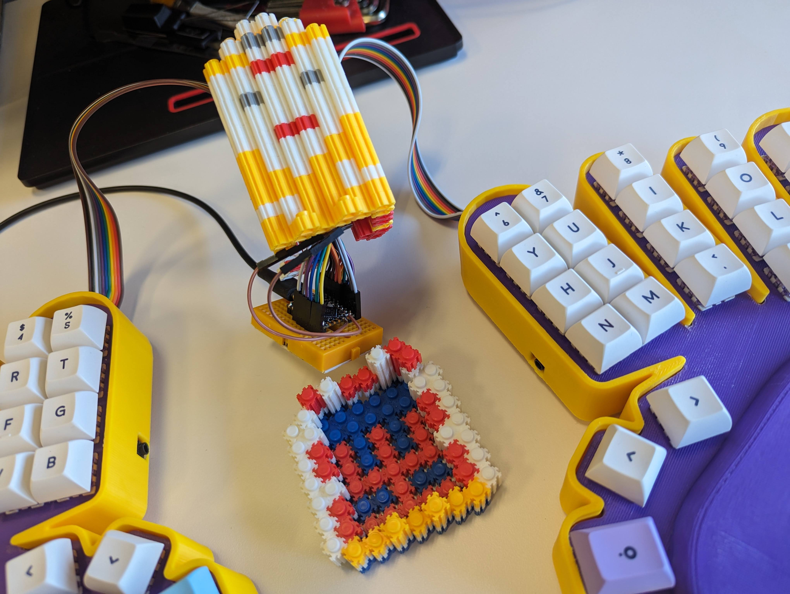

# 五指刪

## 韻文

法寶名爲五指刪

創制者 TIS  
深諳手體工程學法門  
手掌鍵盤孤品一件吾能持否？  
曰：能持  
於是齋戒沐浴恭迎法器  
乃名爲五指刪

當初修爲太淺、使不得  
供奉二百五十六日，我悟了  
原僧主控不用，用佛祖控  
覆盆老祖加持，法力大增 [^1]

自此手起鍵落，毫無遲滯  
雙掌大開大闔，十指筋脈貫通  
並擊聯奏，無不信手拈來  
珠璣數算，躍然熒屏  
不見電氣流動，功率運行  
但聞簧音低鳴，空腔聲迴盪不絕

[^1]: 覆盆老祖 = 樹莓派 RP2040 

## 圖集

